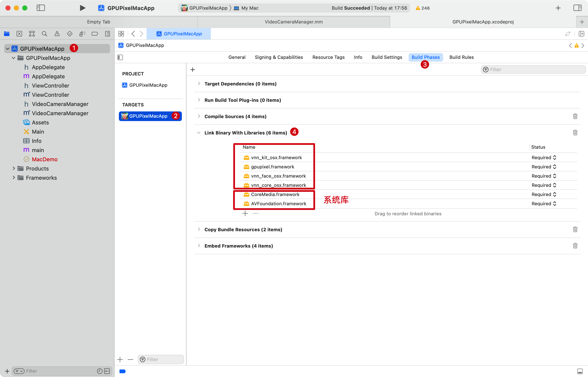
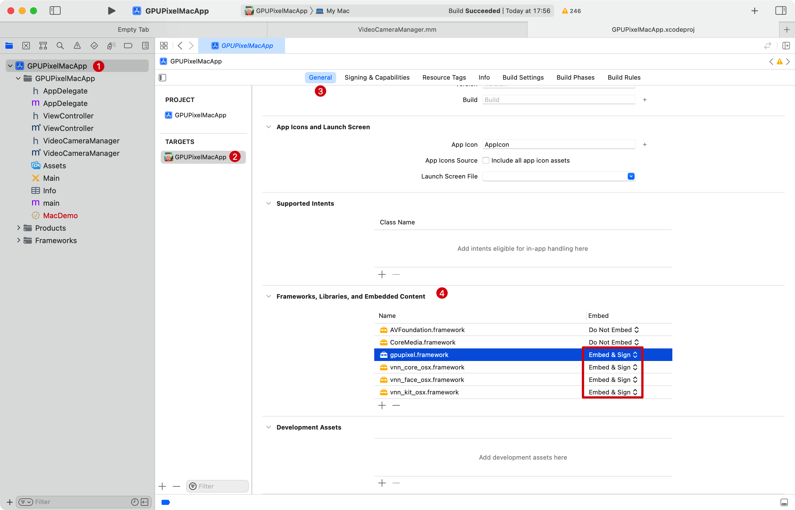

# 集成

本章将介绍GPUPixel在各个系统的集成方法，最新编译好的各个平台库可以从[这里](https://github.com/pixpark/gpupixel/releases/latest)下载

## iOS & MacOS

iOS 和 MacOS库的链接形式相同，放到一块来讲

### 添加依赖

将gpupixel和vnn库拷贝到你的工程目录
::: code-group
```bash [iOS]
├── gpupixel.framework
├── vnn_core_ios.framework
├── vnn_face_ios.framework
└── vnn_kit_ios.framework
```
```bash [MacOS]
├── gpupixel.framework
├── vnn_core_osx.framework
├── vnn_face_osx.framework
└── vnn_kit_osx.framework
```
:::

选择`工程 -> Targets -> Build Phases -> Link Binary With Libraries`

点击左下角的 `+` 号添加如上面的依赖，`CoreMedia.framework` 和 `AVFoundation.framework` 为系统库，提供相机采集等能力，添加完后情况如下图



**嵌入Framework**

选择`工程 -> Targets -> General -> Frameworks, Libraries, and Embeded Content`

将gpupixel和vnn等库设置为 `Embed & Sign`, 系统库选择` Do Not Embed `, 如下




### Objective-C 调用

由于GPUPixel采用C++编写，OC要调用C++需要将OC源文件拓展名由 `.m` 改为 `.mm`，这样就可以实现 OC和C++混编。

GPUPixel对外所有的头文件都包含在 `gpupixel.h`中，只要引入 

```objective-c
#import <gpupixel/gpupixel.h>
``` 

即可调用所有方法，详细库方法调用参考[这里](#)


### Swift 调用
Swift 5.9 之后可以直接与C++交互，也是通过桥接头文件的方式，省去了OC在中间转一道，可以参考[这篇文章](https://cloud.tencent.com/developer/article/2312347) 或 Swift 官方文档[Mixing Swift and C++](https://www.swift.org/documentation/cxx-interop/#calling-c-functions)

## Android

下载最新 `gpupixel-release.aar`, 放入安卓工程下，如 `libs` 目录

在 gradle 中添加依赖

```gradle
dependencies {
    implementation files('libs/gpupixel-release.aar')
}
```
然后 sync 一下工程即可，参考 Android Demo

参考文章：[Android 导入AAR包](https://juejin.cn/post/7226600031569510459)

## Windows
  
## Linux
